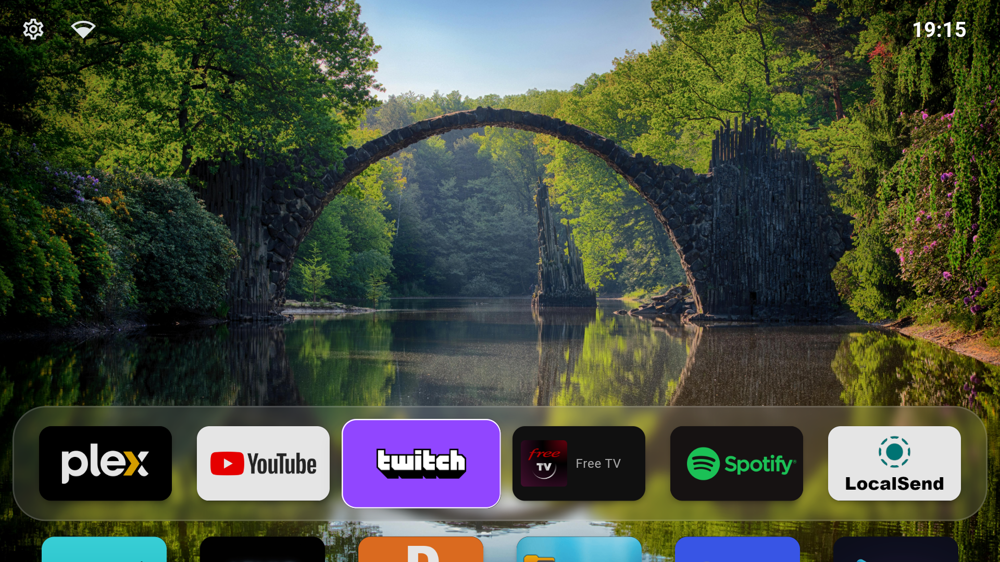
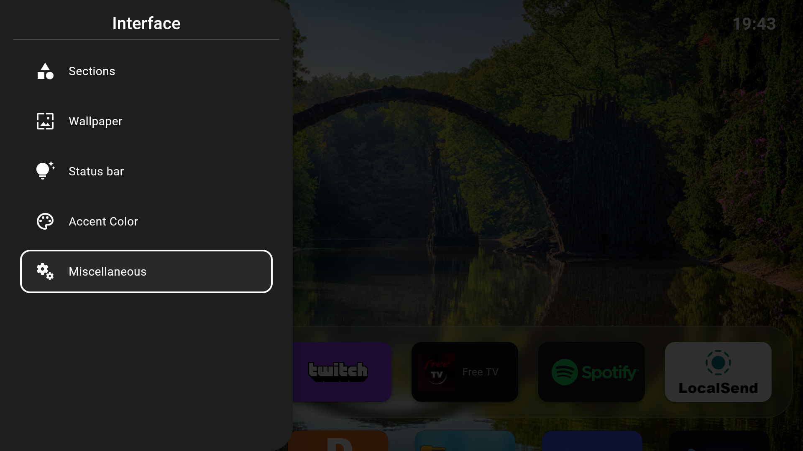
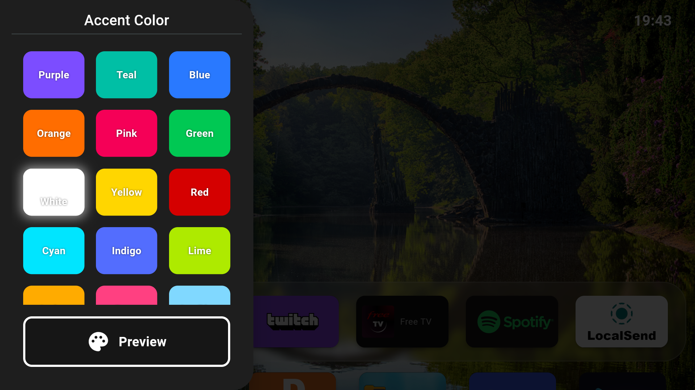
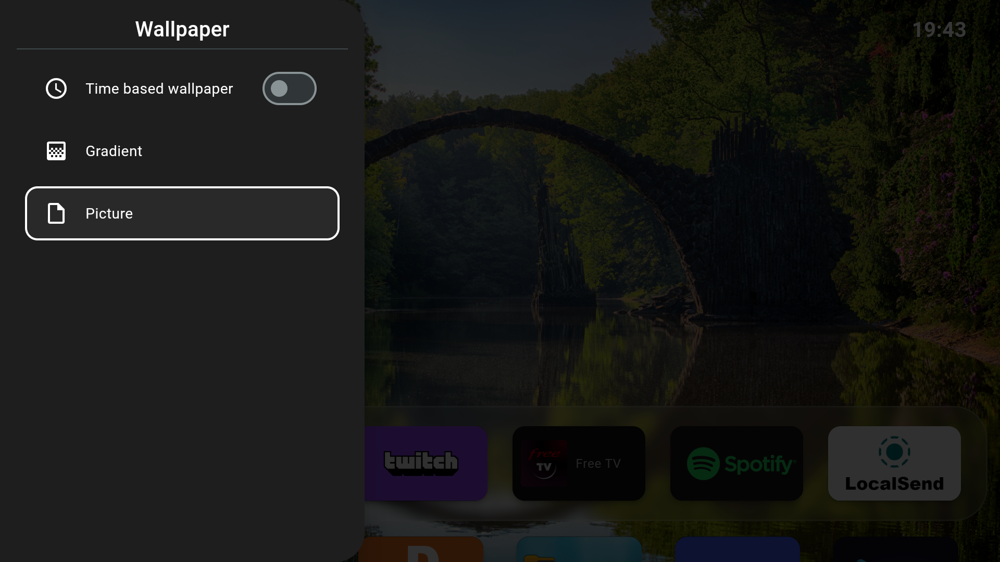
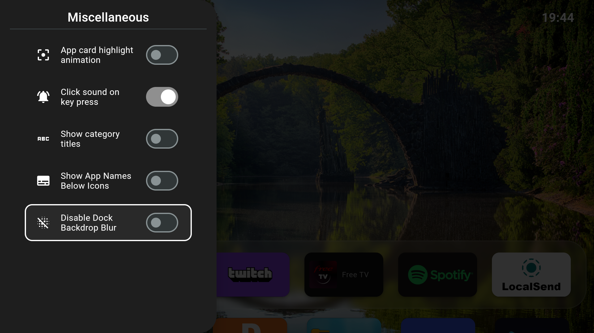
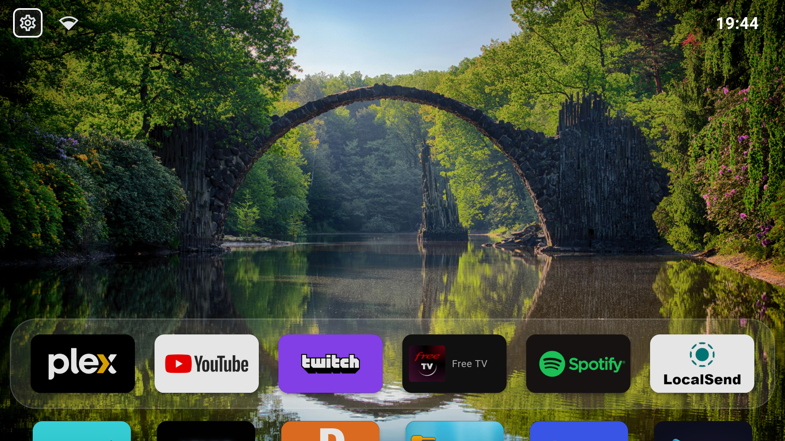
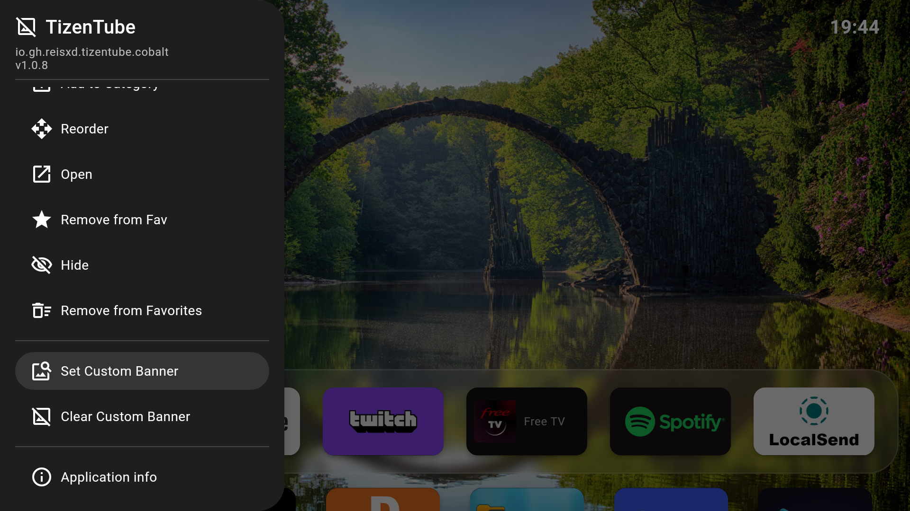

# Arc Launcher

<picture>
  
</picture>

[](https://github.com/meddouribadis/arclauncher/releases/latest) [](https://github.com/meddouribadis/arclauncher/releases) [](https://github.com/meddouribadis/arclauncher/stargazers)

**Arc Launcher** is a fork of [LTvLauncher](https://github.com/LeanBitLab/LtvLauncher) (originally by [etienn01](https://gitlab.com/flauncher/flauncher)) - an open-source alternative launcher for Android TV.

This customized version introduces a modern smart TV-style grid layout, usability enhancements, and UX improvements by [meddouribadis](https://github.com/meddouribadis/LtvLauncher).

<a href="https://github.com/LeanBitLab/LtvLauncher/releases/latest">
  
</a>

## Key Features & Enhancements

- **Modern TV Layout** - Redesigned home screen inspired by premium smart TV interfaces.
- **Data Usage Widget** - Track daily Internet consumption directly from the status bar.
- **Inbuilt OLED Screensaver** - Minimal screensaver with 30s clock position shifting to prevent burn-in.
- **Easy WiFi Access** - Network indicator doubles as a shortcut to system WiFi settings.
- **Quick Presets** - Select Time/Date formats and Category names from a list (No keyboard required).
- **Time-Based Wallpaper** - Automatically switch between day and night backgrounds.
- **Pitch Black Wallpaper** - Added a true black gradient background option.
- **Enhanced Focus Indicator** - New double-border design ensures perfect visibility on any background.
- **Smart Navigation** - Fixed "bounce back" issues and optimized focus traversal for a smoother experience.
- **Refined Settings** - Reorganized menus with a new "Miscellaneous" section and unified focus styles.
- **Accent Color Support** - Personalize the UI with multiple color presets.
- **Improved Sorting** - Easily reorder categories using Left/Right arrow keys instead of finicky gestures.
- **Left Side Settings** - Reorganized settings panel now opens on the left for better reach.
- **Brightness Scheduler (Experimental)** - Automatically adjust system brightness based on time of day (Requires `WRITE_SETTINGS` permission via ADB).
- **New Category** - Added "Favorites".
- **Custom Banner Support** - Display and apply your own personalized custom banners.
- **Optimizations** - Improved performance with aggressive icon caching and code cleanups.
- **Compatibility** - Works on Android TV boxes, Fire TV Stick, and other devices.

> [!WARNING]
> **Brightness Scheduler is an experimental feature.** It is currently untested across all devices and may be removed or modified in future versions based on user feedback.

## Screenshots

<table>
  <tr>
    <td align="center">Settings panel</td>
    <td align="center">Accent colors</td>
    <td align="center">Multiple wallpapers</td>
  </tr>
  <tr>
    <td></td>
    <td></td>
    <td></td>
  </tr>
  <tr>
    <td align="center">Disable blur</td>
    <td align="center">Disabled blur</td>
    <td align="center">Custom banner</td>
  </tr>
  <tr>
    <td></td>
    <td></td>
    <td></td>
  </tr>
</table>

## Original FLauncher Features

- [x] No ads
- [x] Customizable categories
- [x] Manually reorder apps within categories
- [x] Wallpaper support
- [x] Open "Android Settings"
- [x] Open "App info"
- [x] Uninstall app
- [x] Clock
- [x] Switch between row and grid for categories
- [x] Support for non-TV (sideloaded) apps
- [x] Navigation sound feedback

## Set Arc Launcher as default launcher

### Method 1: Remap the Home button

This is the "safer" and easiest way. Use [Button Mapper](https://play.google.com/store/apps/details?id=flar2.homebutton) to remap the Home button of the remote to launch Arc Launcher.

### Method 2: Disable the default launcher

**:warning: Disclaimer :warning:**

**You are doing this at your own risk, and you'll be responsible in any case of malfunction on your device.**

The following commands have been tested on Chromecast with Google TV only. This may be different on other devices.

Once the default launcher is disabled, press the Home button on the remote, and you'll be prompted by the system to choose which app to set as default.

#### Disable default launcher

```shell
# Disable com.google.android.apps.tv.launcherx which is the default launcher on CCwGTV
$ adb shell pm disable-user --user 0 com.google.android.apps.tv.launcherx
# com.google.android.tungsten.setupwraith will then be used as a 'fallback' and will automatically
# re-enable the default launcher, so disable it as well
$ adb shell pm disable-user --user 0 com.google.android.tungsten.setupwraith
```

#### Re-enable default launcher

```shell
$ adb shell pm enable com.google.android.apps.tv.launcherx
$ adb shell pm enable com.google.android.tungsten.setupwraith
```

#### Known issues

On Chromecast with Google TV (maybe others), the "YouTube" remote button will stop working if the default launcher is disabled. As a workaround, you can use [Button Mapper](https://play.google.com/store/apps/details?id=flar2.homebutton) to remap it correctly.

## Wallpaper

Because Android's `WallpaperManager` is not available on some Android TV devices, FLauncher implements its own wallpaper management method.

Please note that changing wallpaper requires a file explorer to be installed on the device in order to pick a file.

## Credits

### Original Projects

- **[FLauncher](https://gitlab.com/flauncher/flauncher)** by [etienn01](https://github.com/etienn01) - The original project
- **[FLauncher (Fork)](https://github.com/osrosal/flauncher)** by [osrosal](https://github.com/osrosal) - Community fork with additional features
- **[LTvLauncher](https://github.com/LeanBitLab/LtvLauncher)** by [LeanBitLab](https://github.com/LeanBitLab) - The base for this fork
- Customizations by [meddouribadis](https://github.com/meddouribadis)

---
